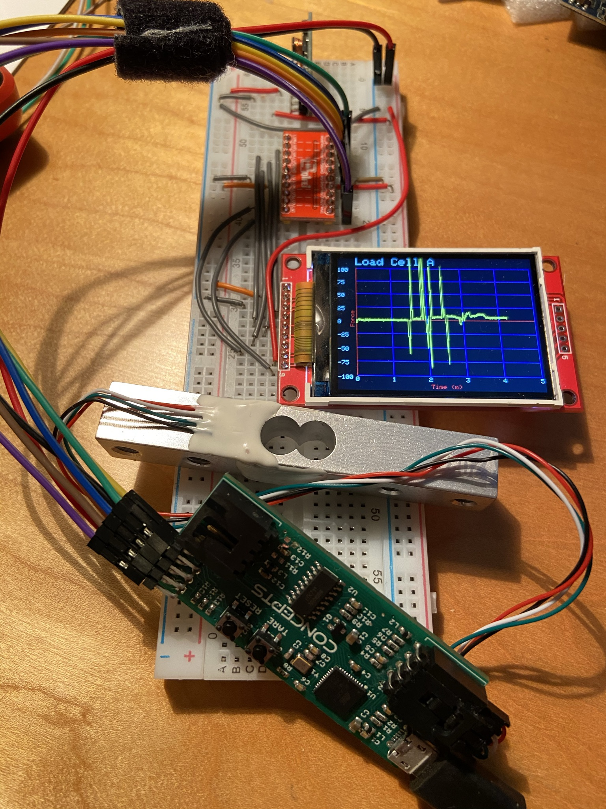

## PlatformIO project for live graphing of load sensor data to an ILI9341 (or other) TFT
Requires hx711 load cell board, compatible load cell (this one is 20kg), and serial SPI ILI9341 screen.  If your screen can only take 3.3V logic, then you also need at least 5 channels of logic conversion.

- Install and run VSCode
- Install the PlatformIO extension from the VSCode extensions pane
- Clone the Photonsters/Print-Load-Sensor repository from the Git pane
- File->Open Folder, then navigate to this ForceSensorGraph directory
- PlatformIO will parse platformio.ini and should install the required frameworks and libraries for you
- Navigate to the libdeps\<board>\TFT_ILI9341 directory and modify User_Setup.h:
  ```
  #define TFT_CS   SCL  // Chip select control pin
  #define TFT_DC   SDA  // Data Command control pin
  #define TFT_RST  -1  // Reset pin (could connect to Arduino RESET pin)
  ```
  - Comment out all of the fonts except the first one.
- Read the comments at the top of the source and include files.  Edit as necessary for your system/hardware
- Build/Upload

## Wiring the TFT to the load cell board:

| Board (wire in photo) | TFT |
| ------- | ----- |
| MOSI (Orange)  | MOSI |
| MISO (Purple)  | MISO |
| RST (Blue) | Reset |
| SCK (Brown) | SCK |
| SCL (Green) | CS |
| SDA (Yellow) | D/C |
| VCC (Red) | VCC |
| GND (Black) | GND |

Also jump VCC over to the LED pin on the TFT. If your MCU is 5V, and your screen only accepts 3.3V logic, you also need at least 5 channels of logic conversion for MOSI, MISO, SCK, SCL(CS), and SDA(D/C).


